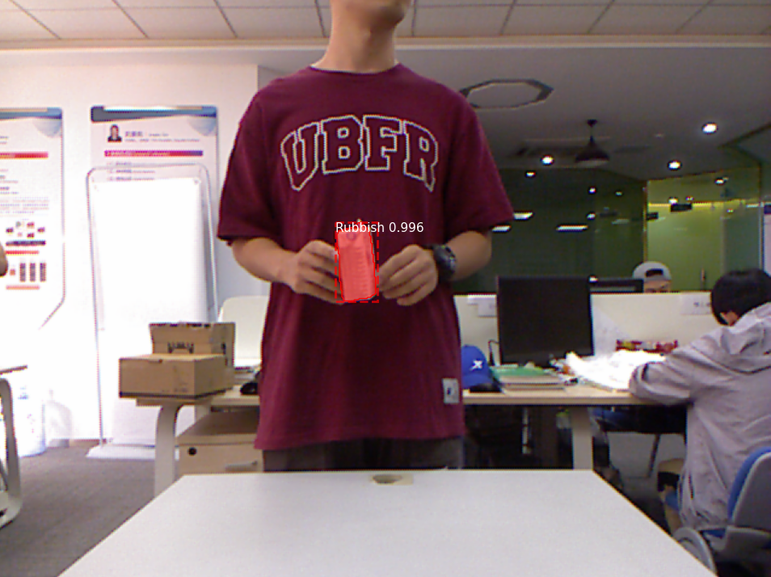

# CSC 537 Final Project

<div align="center">
    <p>Deep learning-based image segmentation for garbage detection</p>
    
</div>


## Supported Python Versions
- Python 3.8.x (YOLOv8)
- Python 3.6.8 (Matterport)

## Folder Structure
```
CSC-537-Final
 ┣ datasets                 # Contains dataset files and configurations
 ┃ ┣ COCO_annotations       # COCO-style annotations (train, val, test) from official MJU-waste github
 ┃ ┣ images                 # Original PNG images (train, val, test)
 ┃ ┣ labels                 # YOLOv8 format labels derived from COCO annotations
 ┃ ┗ masks                  # Pre-generated segmentation masks (train, val, test)
 ┣ envs                     # Virtual environments for different models
 ┃ ┣ matterport_env
 ┃ ┗ yolo_env
 ┣ models                   # Model-specific setup and training scripts
 ┃ ┣ matterport
 ┃ ┗ yolo
 ┣ input                    # Input images to run predictions on with trained models
 ┣ output                   # All YOLO/Matterport training runs saved here
 ┃ ┣ predictions            # Predicted images for YOLO/Matterport sorted by specific run and weights
 ┃ ┣ mrcnn
 ┃ ┗ yolo
 ┣ setup                    # General setup that all models share
 ┣ tmp                      # Temporary storage (when downloading img .zip)
 ┗ download.py              # Download and organize data, install bootstrap requirements
```

<br>

# Download dataset
- Download bootstrap requirements & MJU-Waste dataset (which automatically gets split into folders)
```bash
python .\download.py
```

<br>

# Ultralytics YOLOv8 Guide
- [Ultralytics YOLOv8](models/yolo/README.md)

<br>

# Matterport Mask R-CNN Guide
- [Windows Setup Guide](models/matterport/README_windows.md)
- [Mavos/Linus Setup Guide](models/matterport/README_macos-linus.md)

<br>

## Authors
- Josh Dejeu
- Aniya Watson
- Abhinav Medarametla

## Sources
- [mju-waste Github](https://github.com/realwecan/mju-waste)
- [MJU-Waste Dataset](https://drive.google.com/file/d/1o101UBJGeeMPpI-DSY6oh-tLk9AHXMny/view)
- [Ultralytics](https://github.com/ultralytics/ultralytics/blob/main/docs/en/models/yolov8.md)
- [Matterport](https://github.com/matterport/Mask_RCNN)